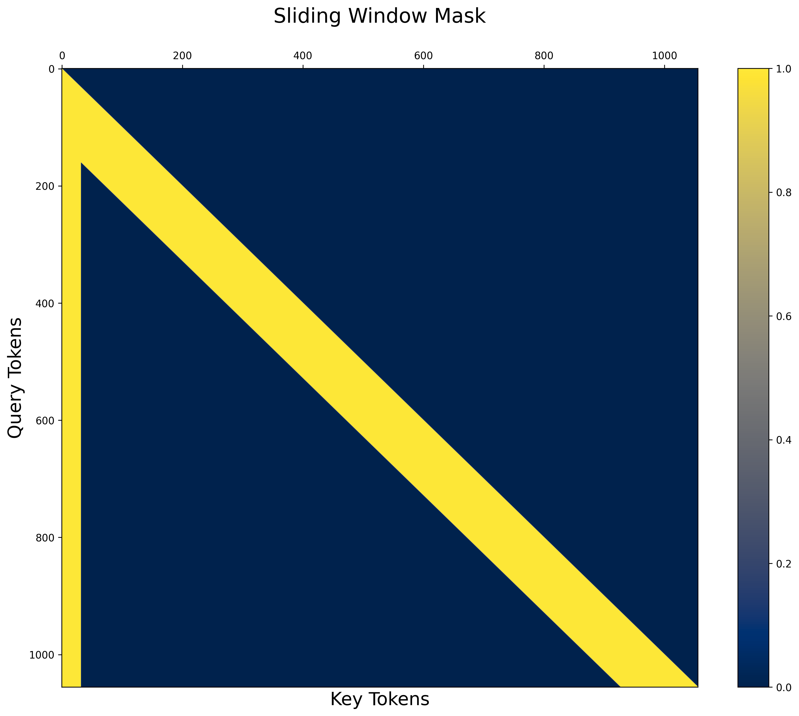

# SWA-SinkMeta


```bash
pip install torch==2.5.0
pip install git+https://github.com/pytorch-labs/attention-gym.git
```


`num_meta_tokens = 32, window_size = 128, seq_length = 1024`

<figure style="text-align: center; margin: 20px auto;">
  
  <figcaption style="color: #666; font-size: 0.9em; margin-top: 10px;"></figcaption>
</figure>